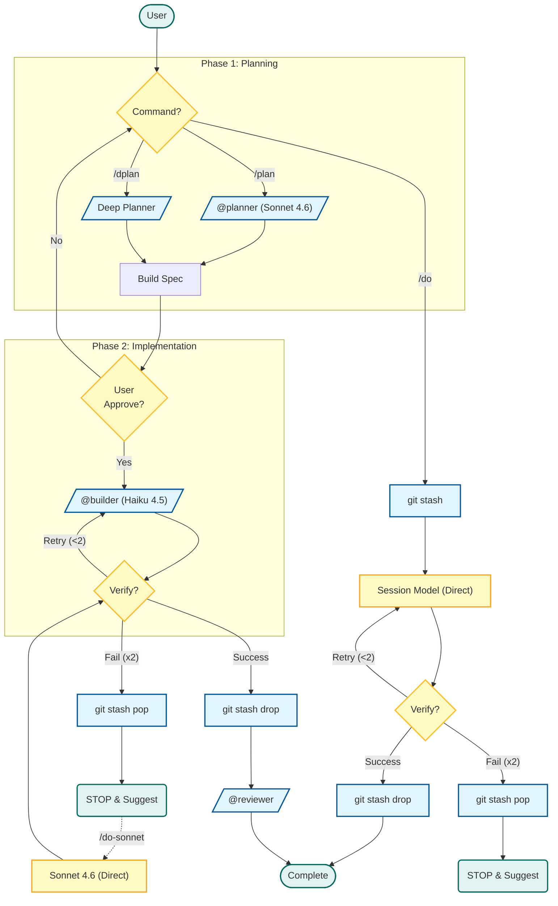

> **[한국어 버전](README.ko.md)**

# Agents Directory

## Purpose
Contains sub-agent definitions for role-based task delegation with model optimization.

> **Path note:** Prompt snippets use installed paths (`~/.claude/...`). In this repository, equivalent source paths are `./.claude/...` and `./scripts/...`.

## Contents

| Agent | Model | Role | Tools | Questions |
|-------|-------|------|-------|-----------|
| `planner.md` | Sonnet 4.6 | Architecture & design decisions | Read, Glob, Grep (read-only) | ≤3 (with defaults) |
| `dplanner.md` | Sonnet 4.6 | Deep planning with research | sequential-thinking, perplexity, Read, Glob, Grep | Unlimited |
| `builder.md` | Haiku 4.5 | Implementation (2-retry cap) | Read, Write, Edit, Bash, Glob, Grep | None → Escalate |
| `reviewer.md` | Haiku 4.5 | Code review & QA | Read, Glob, Grep (read-only, enforced) | None → Escalate |

## When to Use Each Agent

### @planner (Quick Planning)
**Use for:**
- Tasks affecting 5+ files
- Architectural decisions needed
- Unclear requirements requiring clarification
- New feature implementation

**Triggers:** `/plan [task]`

**Output:** Architecture design + task breakdown (no code)
**Output Budget:** Max 1 sentence per task, file paths only (no code previews)

### @dplanner (Deep Planning)
**Use for:**
- Complex architectural problems requiring deep analysis
- Technology stack evaluation
- Debugging race conditions or deadlocks
- Research-heavy decisions (needs latest docs/articles)

**Triggers:** `/dplan [task]`

**Capabilities:**
- `sequential-thinking`: Multi-step logic verification
- `perplexity`: Web research (blogs, forums, latest articles)
- Current library docs via the official Context7 Claude Code integration when installed

**Output Budget:** Max 60 lines (code blocks excluded). Cite source + 1-line insight per source.

### @builder (Implementation)
**Use for:**
- All coding tasks after planning
- Simple well-defined tasks (direct `/do`)
- Bug fixes with clear reproduction

**Triggers:** `/plan` delegation, `/dplan` delegation, direct `@builder [task]` call

**Protocol:**
- Maximum 2 retries → Escalate on failure
- Uses `~/.claude/scripts/verify.sh` (runtime-adaptive)
- No questions allowed (assumes or escalates)

**Output Budget:** Success summary MAX 5 lines (file list + verification only). Escalation MAX 8 lines. No full code blocks — file:line references only.

**Rollback Protocol:**
- Via `/do*`: `~/.claude/scripts/snapshot.sh push` creates labeled stash with depth guard
- On success: `~/.claude/scripts/snapshot.sh drop` (label-checked, safe no-op if no snapshot)
- On failure: `~/.claude/scripts/snapshot.sh pop` (label-checked, falls back to `git checkout .`)
- Prevents dirty state that can add extra manual cleanup turns (2-4 messages is an estimate)

### @reviewer (Code Review)
**Use for:**
- Post-implementation quality check
- Security audit
- Conflict detection
- Type safety verification

**Triggers:** `/review [target]`

**Categories:** SEC (Security), TYPE (Type safety), PERF (Performance), STYLE (Convention), LOGIC (Logic error), TEST (Missing test)

**Output Budget:** PASS = 1 line only. FAIL = MAX 30 lines (top 5 issues by severity, file:line references only).

## Workflow (Detailed Flowchart)




## Design Decisions

| Decision | Rationale |
|----------|-----------|
| 4 agents (vs. Affaan's 13) | Pro Plan constraint: Each sub-agent invocation costs quota. Role consolidation reduces API overhead while maintaining capability |
| Haiku 4.5 for @builder and @reviewer | Cost optimization: Implementation and review don't need Sonnet-level reasoning. Haiku 4.5 is 5x cheaper ($1 vs $5 /MTok input) |
| Sonnet 4.6 for @planner and @dplanner | Architecture decisions need reasoning capability. Sonnet 4.6 balances cost/performance better than Opus 4.6 on Pro Plan |
| @builder 2-retry cap | Prevents quota drain. Failed twice → Escalate to Sonnet 4.6/Opus 4.6 or @planner for re-design |
| @reviewer read-only enforcement | Hook-based blocking (`readonly-check.sh`). Prevents accidental modifications during review |
| @dplanner with research tools + official docs integration | Research-heavy tasks justify deeper planning. `sequential-thinking` + `perplexity` cover reasoning and web research, while current library docs can use official Context7 when installed |
| Output Budget per agent | Output costs 5x Input (API pricing). Strict budgets: builder 5 lines, reviewer 1 line PASS / 30 lines FAIL, dplanner 60 lines, planner 1 sentence/task |
| @builder atomic rollback | `~/.claude/scripts/snapshot.sh` handles `git stash` with depth guard + label check before `/do` execution. Prevents popping unrelated user stashes. Failure triggers `pop` (or `git checkout .` on clean tree) → clean state for immediate escalation. Estimated savings: 2-4 messages per failure, zero API cost |

## Adding Custom Agents

Create a new `.md` file with **frontmatter** (required):

```markdown
---
name: my-agent
description: When to use this agent
model: haiku | sonnet | opus
permissionMode: plan | acceptEdits
tools: Read, Write, Edit, Bash, Glob, Grep
disallowedTools: Write, Edit
hooks:
  Stop:
    - hooks:
        - type: command
          command: "~/.claude/scripts/hooks/my-hook.sh"
          timeout: 5
---

# My Agent

## Role
What this agent does.

## Rules
- Rule 1
- Rule 2

## Output Format
\`\`\`
Expected output
\`\`\`
```

### Frontmatter Fields

| Field | Required | Description |
|-------|:--------:|-------------|
| `name` | Yes | Agent identifier (lowercase, hyphens) |
| `description` | Yes | When to use this agent (for Task tool auto-selection) |
| `model` | Yes | `haiku`, `sonnet`, or `opus` |
| `permissionMode` | No | `plan` (read-only) or `acceptEdits` (write access) |
| `tools` | No | Allowed tools (whitelist) |
| `disallowedTools` | No | Blocked tools (blacklist) |
| `hooks` | No | Lifecycle hooks (`PreToolUse`, `PostToolUse`, `Stop`) |

### Location
- Global: `~/.claude/agents/` (all projects)
- Project: `./.claude/agents/` (this project only)
