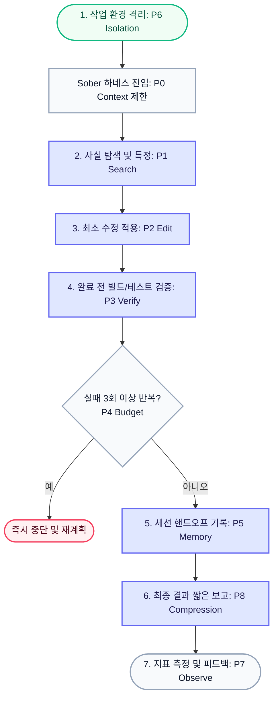

# Sober


[](https://www.npmjs.com/package/getsober)
[](https://nodejs.org)
[](LICENSE)
[](http://makeapullrequest.com)
[](https://github.com/move-hoon/sober)

---

<div align="center">

**Language / 언어**

[English](README.md) | [**한국어**](README.ko.md)

</div>

---

**AI 코딩 에이전트가 흥분해서 추측하거나 과하게 수정하지 않도록, 차분하고 검증 가능한 방식으로 일하게 합니다.**

Sober는 Claude Code와 Codex CLI가 과하게 읽고, 과하게 수정하고, 검증 없이 "완료"라고 말하지 않도록 붙잡아주는 로컬 제어 하네스(local control harness)입니다. 에이전트가 다음 루프를 따르도록 안내합니다:

```text
먼저 찾기 → 필요한 것만 읽기 → 작고 안전하게 수정하기 → 검증하기 → 핸드오프 남기기
```

그 중심에는 두 런타임이 공유하는 단일 작업 계약인 `AGENTS.md`가 있습니다.

기존 설정을 덮어쓰지 않습니다. 모든 것은 추가형으로 동작하며, 제거 시에는 Sober가 만든 파일과 링크만 삭제합니다.

```bash
npm install -g getsober@latest
sober setup
```

Sober를 기본 제어 레이어로 두고, 그 위에 custom command, subagent, MCP 도구, 프로젝트 전용 규칙을 얹어 사용하세요.

---

## 왜 Sober인가요?

AI 코딩 에이전트는 강력하지만, 기본값 그대로 쓰면 의욕이 앞서 과하게 행동할 때가 많습니다.

| Sober 없이 | Sober와 함께 |
| ---------------------------------- | --------------------------------------------- |
| 한 줄 찾으려고 파일 전체 읽기 | 정확한 `file:line`을 먼저 찾기 |
| 코드 위치를 추측하기 | 결정론적 도구로 후보 검증 |
| 시킨 것보다 더 많이 수정하기 | 가장 작고 안전한 수정만 적용 |
| 관련 없는 파일 포맷팅/정리하기 | 관련 없는 파일은 그대로 두기 |
| 검증 없이 "끝났습니다" 보고 | 실행 가능한 가장 가까운 빌드/테스트 실행 |
| 실패한 접근법 반복 시도 | 반복 실패 시 중단하고 재계획 수립 |
| 장황하고 자신만만한 요약 보고 | 결과, 변경 파일, 테스트 결과, 리스크만 보고 |
| 이전 세션 흐름 유실 | 명확한 `HANDOFF.md` 작성 |

**목표: 모델의 사고력은 판단에 쓰고, 작업 흐름은 사실, 최소 수정, 검증 안에 머물게 한다.**

---

## Sober가 뭔가요?

Sober는 새로운 AI 에이전트가 아닙니다. 호스팅 서비스도, 프롬프트 모음집도, 토큰 최적화 도구도 아닙니다.

Sober는 이미 사용 중인 Claude Code와 Codex CLI에 로컬 작업 규율을 더해주는 제어 하네스입니다.

공유 `AGENTS.md`, 스킬, 훅을 설치하여 기존 에이전트가 다음과 같이 차분한 워크플로우 안에서 움직이도록 붙잡아줍니다:

- **컨텍스트 전에 사실 확인 (Fact before context)** — 파일 전체를 넓게 열기 전에 정확한 `file:line`부터 확인합니다.
- **수정 전에 근거 확인 (Evidence before edits)** — 코드를 바꾸기 전에 결정론적 도구로 대상을 검증합니다.
- **최소한만 패치 (Small patches only)** — 딱 작업에 필요한 부분만 안전하게 수정합니다.
- **완료 선언 전 증명 (Proof before "done")** — 실행 가능한 가장 확실한 빌드 및 테스트 단계를 돌립니다.
- **실패 반복 시 즉시 정지 (Stop after repeated failure)** — 안 되는 방식을 고집하며 컨텍스트와 비용을 낭비하지 않습니다.
- **간결한 보고 유지 (Brief reports only)** — 결과, 변경 파일, 검증 내용, 위험 요소만 표시합니다.
- **투명한 핸드오프 (Visible handoff)** — 로컬 `HANDOFF.md` 파일에 현재 세션 상태를 투명하게 보존합니다.

설치 후에도 평소와 똑같이 `claude` 또는 `codex`를 실행하면 됩니다.

마음에 안 드신다면? `sober uninstall` 한 줄이면 Sober 심볼릭 링크, 훅, `~/.sober`만 깔끔하게 지워지고 기존 사용자 설정은 그대로 남습니다.

---

## Sober 작동 원리

Sober는 시각적 루프, 핵심 설계 원칙, 구체적인 작업 계약이라는 세 가지 차원에서 동작합니다.

### 1. Sober 루프 (실행 흐름)

Sober는 새 에이전트를 만드는 것이 아니라, 기존 Claude Code와 Codex CLI가 차분한 작업 계약 안에서 움직이도록 붙잡아줍니다.



이 루프는 두 런타임이 공유하는 단일 작업 규칙 파일인 [`AGENTS.md`](AGENTS.md)에 정의되어 있습니다. 각 정책(P0–P8)은 실행 주기에 따라 다음과 같은 역할로 개입합니다:

* **순차 실행 단계** (`P1` → `P2` → `P3` → `P5`)
  * 사용자 요청이 접수되면 **사실 탐색(P1)**으로 시작하여, **최소 수정(P2)**을 거쳐, **테스트 검증(P3)**을 수행한 후, 세션 종료 시 **핸드오프 작성(P5)**으로 마치는 선형적인 작업 라이프사이클을 주도합니다.
* **상시 가드레일** (`P0`, `P4`, `P8`)
  * 전체 루프가 실행되는 동안 컨텍스트가 커지면 압축을 유도하고(**P0**), 같은 가설이 반복 실패하면 중단 및 재계획을 요구하며(**P4**), 보고는 결과 중심으로 압축(**P8**)하도록 안내합니다.
* **시스템 전제 및 피드백** (`P6`, `P7`)
  * 작업 착수 전 깨끗한 Git 격리 환경을 확보(**P6**)하고, 도구나 규칙 추가 시 KPI 지표를 측정(**P7**)하여 피드백을 반영합니다.


Sober 위에는 사용자 정의 명령어, 서브에이전트, MCP 도구, 프로젝트 전용 규칙을 자유롭게 얹을 수 있습니다.

### 2. 5가지 불변식 (설계 원칙)

모델이 아무리 발전하더라도 Sober가 변치 않고 고수하는 5가지 아키텍처 기둥입니다:

1. **정책 계약 (Policy Contract):** LLM을 판단의 영역에만 가두는 P0-P8 규칙.
2. **결정론적 오프로드 (Deterministic Offload):** 검색, 변환, 대용량 출력은 코드와 도구에 맡깁니다.
3. **검증 게이트 & 격리 (Verification Gate & Isolation):** 검증 없는 상태 변경을 경고하고, 작업은 되돌릴 수 있는 git 경계(worktree 등) 안에 유지합니다.
4. **영속적 사람 리뷰 메모리 (Persistent Memory):** 불투명한 데이터베이스 대신 파일 기반 로컬 메모리(`HANDOFF.md`)를 사용합니다.
5. **관측 (Observation):** 모든 도구와 규칙 추가는 측정으로 정당화되어야 합니다.

### 3. Sober 작업 계약 (에이전트 규칙)

Sober의 중심은 하나의 공유 `AGENTS.md`입니다. 이 파일은 사람만 읽는 문서가 아니라, 에이전트가 매 턴 따라야 하는 실제 작업 계약입니다. 에이전트의 기본 행동을 더 엄격한 작업 루프로 통제합니다:

| 정책 (Policy) | 핵심 규칙 | 세부 지침 및 제한 사항 |
| :--- | :--- | :--- |
| **`P0 Context`** | **컨텍스트 절제** | 전체 파일을 한 번에 읽지 않고 정확한 `file:line`과 인접한 ~2줄만 확인합니다. 검색 결과를 `| head`로 제한하고, 컨텍스트가 커지면 압축을 유도합니다. |
| **`P1 Search`** | **읽기 전 검색** | 수동으로 코드를 훑어보지(hand-grep) 않으며, 키워드/정규식 매칭에는 `ripgrep`, 정의/호출부 구조 분석에는 `Probe`, 개념적 검색에는 최후의 수단으로 `mgrep`을 차례대로 오프로드합니다. |
| **`P2 Edit`** | **최소 수정** | 요청된 변경 사항만 정밀 패치합니다. 반복적이고 기계적인 수정에는 `ast-grep --rewrite`를, 타입 인지 단일 심볼 변경에는 Serena `replace_symbol`을 사용하여 LLM의 직접 코드 재작성을 최소화합니다. |
| **`P3 Verify`** | **완료 전 검증** | 검증되지 않은 가설로 상태를 바꾸지 않도록 요구합니다. 후보군을 깊이 읽기 전 `ripgrep`, `Probe`, Serena 중 하나로 먼저 확인하고, 완료 선언 전 가능한 가장 가까운 빌드/테스트/검증 단계를 실행하게 합니다. |
| **`P4 Budget`** | **실패 반복 중단** | 턴 제한(검색 1회, 수정 1~2회, 디버깅 3회)을 준수합니다. 같은 추측을 고집하는 대신 3회 이상 가설이 실패하면 즉시 중단하고 재계획을 수립합니다. |
| **`P5 Memory`** | **투명한 핸드오프** | 세션 상태는 `HANDOFF.md`에, 아키텍처 및 정적 지식은 `.serena/memories`에 사람이 리뷰할 수 있도록 분리 기록하며, 에이전트의 자동 실행이나 블라인드 프롬프트 주입을 차단합니다. |
| **`P6 Isolation`** | **되돌릴 수 있는 격리** | 모든 작업을 되돌릴 수 있는 명확한 git 경계 내에 유지합니다. 병렬 작업이나 대규모 코드 탐색은 git worktree 또는 서브에이전트를 활용해 완전히 격리된 환경에서 진행합니다. |
| **`P7 Observe`** | **측정 기반 추가** | 도입되는 모든 도구와 규칙은 계량 지표(비용, 컨텍스트 사용량, 실패 재시도 횟수)로 가치를 증명해야 하며, 지표가 하나라도 나빠지면 즉시 롤백합니다. |
| **`P8 Compression`** | **짧은 보고** | 장황한 대화형 설명이나 파일 내용의 불필요한 출력을 피하고, `caveman` 출력 압축 스킬을 로드하여 최종 결과, 변경 파일 목록, 테스트 결과만 간결하게 요약 보고합니다. |

#### 작업 계약과 도구 연결 방식

| 계약 정책 | 제어 및 지원 구성 요소 (~/.sober/) |
| :--- | :--- |
| **`P0` / `P1` 파일 조회 및 검색** | `search-ladder` 스킬, `ripgrep`, Probe |
| **`P2` 최소 수정 및 정밀 패치** | `edit-deterministic` 스킬, `ast-grep`, Serena (LSP) |
| **`P3` 완료 전 빌드/테스트 검증** | `verify-gate` 훅, `verify.sh` 스크립트 |
| **`P4` 반복 실패 시 조기 중단** | `tool-failure-log` 훅, `analyze-failures.sh` 명령어 |
| **`P5` 세션 상태 보존 (핸드오프)** | `handoff-write` 훅, `HANDOFF.md` 파일 |
| **`P8` 짧은 보고서 출력 압축** | `caveman` 스킬 |
| **`P7` 지표 기반의 규칙 확장** | `observe` 스킬, `/measure` 명령어 |

---

## 빠른 시작

### 사전 요구사항

- [Claude Code](https://docs.anthropic.com/en/docs/claude-code) 또는 [Codex CLI](https://github.com/openai/codex)가 먼저 설치되어 있어야 합니다.
- Node.js 18+

### 설치

```bash
npm install -g getsober@latest
sober setup
```

### 상태 확인

```bash
sober doctor
```

### 프로젝트에 Sober 적용

```bash
cd your-project
sober template .  # 프로젝트 내부에 AGENTS.md, HANDOFF.md 등을 생성합니다.
claude            # 또는: codex
```

명확한 범위의 프롬프트로 작업을 요청해 보세요:

```text
로그인 타임아웃 버그를 고쳐줘.
관련 위치를 먼저 찾고, 가장 작고 안전한 변경을 적용한 뒤 테스트로 검증해줘.
```

이게 끝입니다. 매일 쓰는 명령어는 평소처럼 `claude` 또는 `codex`입니다.

### 어디에 무엇이 설치되나요?

Sober는 두 개의 고유한 범위를 사용합니다:

1. **글로벌 홈 범위 (`~/`)** — `sober setup`으로 생성
   - `~/.sober`: 정책, 훅, 스킬을 보관하는 기준 디렉터리.
   - `~/.claude` 및 `~/.codex`: Sober가 주입하는 설정 및 규칙.

2. **로컬 프로젝트 범위 (`./`)** — `sober template`으로 생성
   - `your-repo/AGENTS.md`: 해당 프로젝트 전용 행동 강령.
   - `your-repo/HANDOFF.md`: 해당 프로젝트의 세션 연속성 유지 메모리.

---

## 사용 가이드

### 효과적인 프롬프트 작성법

정지 조건이 없는 넓은 범위의 프롬프트가 쿼터를 가장 많이 낭비합니다. 항상 완료 기준(완료 정의)을 포함하세요.

가장 중요한 습관: **에이전트에게 무엇을 할지, 무엇을 건드리지 말지, 그리고 어떻게 검증할지 지시하세요.**

좋은 프롬프트 예시:

```text
결제 재시도 타임아웃을 3초에서 5초로 변경해줘.
그 외의 동작은 동일하게 유지해야 해.
기존 결제 테스트 코드로 검증해줘.
```

나쁜 프롬프트 예시:

```text
이 레포 정리 좀 해줘.
```

### 스킬 — 이게 뭐고 언제 쓰나요?

스킬은 터미널 명령어가 아닙니다. AI가 작업 중에 참고하는 작은 행동 지침서입니다.

스킬 이름을 직접 언급할 필요 없이, 에이전트가 보여주었으면 하는 행동을 프롬프트에 포함하여 요청하면 됩니다.

| 스킬 | 이런 상황에 유용 | 프롬프트 예시 |
| -------------------- | -------------------------------------------------------------------------- | --------------------------------------------------------------------------------------------------------------------------- |
| `karpathy`           | 모든 작업 | "요청한 변경만 해줘. 관련 없는 파일은 정리하지 마." |
| `search-ladder`      | 코드 찾을 때 | "먼저 관련 `file:line`을 찾아줘. 파일 전체를 읽지 마." |
| `edit-deterministic` | 반복적인 변경 | "비슷한 모든 호출 사이트에 반복 가능한 재작성을 사용해줘." |
| `caveman`            | 답변이 길 때 | "결과, 변경 파일, 테스트 결과, 리스크만 요약해줘." |
| `observe`            | 도구/규칙 추가할 때 | "전후를 측정해줘. 지표가 나아질 때만 변경을 유지해." |
| `sober-review`       | 커밋 전 점검 | "sober-review 체크리스트를 실행해줘. 이슈만 보고하고 편집은 하지 마." |
| `structure-graph`    | 큰/낯선 레포에서 흐름·의존성·영향 범위가 불명확할 때 | "구조 힌트를 위해 GitNexus CLI로 맵핑해줘. 깊게 읽거나 수정하기 전에는 rg/Probe로 후보를 검증해줘." |

### 에이전트가 막혔을 때

더 밀어붙이지 말고, 방향을 전환하세요.

1. **작업을 더 작은 조각으로 줄이세요.**
2. **수정하기 전에 계획을 요구하세요:** "수정하기 전에 3줄짜리 계획을 먼저 작성해줘."
3. **근거를 재점검하세요** — 이전 검색 결과가 오래되었을 수 있습니다.
4. **3번 실패하면 정지** — 동일한 아이디어가 3번 연속 실패하면 중단하고 처음부터 다시 계획을 세우세요.
5. **도구 에러 분석** — Claude Code에서는 `/analyze-failures`를 사용하세요. Codex CLI에서는 에이전트에게 `~/.sober/scripts/analyze-failures.sh`를 실행해 출력만 읽고, 반복되는 실패 패턴과 다음에 시도할 가장 작은 계획만 요약해 달라고 요청하세요.

### 세션 핸드오프

대화가 길어지면 노이즈가 생깁니다. 세션을 종료하기 전에 다음과 같이 명확한 요약을 요청하세요:

```text
검증된 사실, 남은 리스크, 다음에 실행할 명령어만 간결하게 요약해줘.
```

Sober의 핸드오프 훅은 git 프로젝트에서 세션이 종료될 때 현재 브랜치, 마지막 커밋, 그리고 커밋되지 않은 변경 사항을 자동으로 `HANDOFF.md`에 기록합니다.

새로운 세션을 시작할 때 에이전트에게 `HANDOFF.md`를 먼저 읽도록 지시하면 중단된 부분부터 자연스럽게 이어서 작업할 수 있습니다.

### 커밋 전 리뷰

사소하지 않은 복잡한 변경인 경우 읽기 전용 리뷰를 실행하세요:

```text
이 diff에 대해 sober-review 체크리스트를 실행해줘.
PASS 또는 ISSUES만 보고하고, 파일은 직접 수정하지 마.
```

이 과정은 코드를 직접 수정하지 않고 정확성, 작업 범위, 복잡성, 코드 스타일, 검증 커버리지, 그리고 기본적인 보안 취약점을 점검합니다.

### 도구 추가 전 측정

새로운 도구, 스킬, 규칙을 추가하기 전에는 항상 전후 비교 측정을 수행하세요.

Claude Code에서는 Sober의 `/measure` 명령을 사용할 수 있으며, Codex에서는 프롬프트에 그대로 입력하면 됩니다:

```text
/measure baseline
# 설정/구성을 딱 하나만 변경
/measure after
```

유심히 관찰해야 할 주요 지표:

- 작업당 읽은 파일 수
- 출력 토큰 수
- 최대 컨텍스트 사용량
- 재시도 빈도

지표 중 어느 하나라도 더 나빠진다면 즉시 원래대로 롤백하십시오.

---

## 명령어 모음

```bash
sober install          # 정책 파일만 전역에 적용 / 갱신
sober setup            # 정책 설치 후 Context7과 핵심 검색·편집 툴킷을 대화형으로 제안
sober doctor           # 설치 상태, 의존성, 훅 및 선택 도구 상태 점검
sober template [dir]   # 프로젝트에 전용 규칙과 HANDOFF.md 추가
sober uninstall        # Sober 심볼릭 링크와 ~/.sober 제거
```

---

## 선택 도구

Sober는 아래 도구들이 없어도 기본적으로 잘 동작합니다. 다만 일부 도구는 특정 작업 유형에서 읽어야 하는 파일 개수나 출력량, 혹은 재시도 횟수를 크게 절감해 줍니다.

`sober setup`은 핵심 검색/편집 툴킷(`ripgrep`, `ast-grep`, `Probe`) 및 Context7 설정만 대화형으로 제안합니다.

`GitNexus`, `Serena`, `mgrep`과 같은 조건부 도구들은 `sober doctor`를 통해 현재 상태와 설치 힌트를 안내하며, 해당 도구가 실제로 효율성을 보여줄 수 있을 때에만 수동으로 추가하시는 것을 권장합니다.

### 핵심 선택 툴킷

대부분의 프로젝트에서 효과가 큰 도구입니다. Sober의 기본 루프인 “검색 → 최소 수정 → 검증 → 짧은 보고”를 더 저렴하고 안정적으로 만듭니다.

| 도구 | Sober 루프에서의 역할 | 사용 트리거 |
|---|---|---|
| `ripgrep` | 정확한 텍스트 위치를 빠르게 찾기 | 심볼명, 키워드, 정규식을 알고 있을 때 |
| `ast-grep` | 기계적 코드 구조 변경 적용 | 반복되는 코드 형태를 바꿀 때 |
| Probe | 구조적 코드 후보 찾기 | 정의, 호출부, 코드 패턴을 찾을 때 |

### 조건부 도구

해당 작업에서 반드시 필요한 경우에만 추가하여 사용하십시오. 기본 설치 경로에는 포함되지 않으며, `sober doctor`가 현재 상태와 설치 힌트를 제공합니다.

| 도구 | Sober 루프에서의 역할 | 사용 트리거 |
|---|---|---|
| Serena | 심볼 기반 탐색과 타입 인지 편집 | 단일 심볼 수정, rename, LSP 탐색이 필요할 때 |
| Context7 / `ctx7` | 최신 외부 문서 확인 | 라이브러리 API가 불확실할 때 |
| `gitnexus` | 대형 레포의 구조 후보 좁히기 | 흐름, 의존성, 영향 범위가 불명확할 때 |
| `mgrep` | 최후 수단 개념 검색 | 정확한 토큰명을 모를 때 |

Sober는 선택 도구를 “항상 켜두는 강화 장치”로 보지 않습니다. 도구는 트리거가 있을 때만 사용하고, 결과는 근거로 검증하며, 읽기량·출력량·재시도 횟수를 늘리면 되돌리는 것을 기본 원칙으로 삼습니다.

**GitNexus 참고:** Sober는 GitNexus를 정답이 아니라 구조 힌트 생성기로 다룹니다. `gitnexus analyze --skip-agents-md --skip-skills --skip-embeddings`로 Sober 파일과 비용을 보호하고, 후보는 깊게 읽기 전에 `rg` 또는 Probe로 검증합니다.

```bash
sober setup       # 정책 설치 후 핵심 툴킷과 Context7 설정을 대화형으로 제안
sober doctor      # 현재 상태와 조건부 도구 설치 힌트 확인
```

Context7 직접 설치:

```bash
npm install -g ctx7
ctx7 setup --cli --claude
ctx7 setup --cli --universal
```

Codex MCP 모드에서 Context7 사용:

```bash
codex mcp add context7 -- npx -y @upstash/context7-mcp --api-key YOUR_API_KEY
```

---

## 안전과 프라이버시

- **추가형 설치** — 기존 설정을 절대 덮어쓰지 않으며, 오직 Sober 소유의 훅과 규칙만 병합합니다.
- **로컬 런타임** — 호스팅되는 Sober 서비스가 없으며, 설정 시 다운로드하도록 선택한 도구만 가져옵니다.
- **API 키 불필요** — 사용자의 모델 인증 정보를 절대로 요구하거나 수정하지 않습니다.
- **안전 가드레일** — 위험한 쉘 명령어는 Claude의 경우 훅(hook)이, Codex의 경우 Starlark 규칙이 감지하여 차단합니다.
- **조언용 검증** — 검증 경고는 강제 조치가 아니며, `git commit`을 강제로 막지 않습니다.
- **투명한 메모리** — 세션 메모리는 불투명한 DB가 아닌 사용자가 직접 읽고 편집할 수 있는 `HANDOFF.md` 파일입니다.
- **시크릿 마스킹** — 도구 실패 로그 기록 시 API 키와 토큰을 자동으로 숨겨서 기록합니다.

---

## 문제 해결

| 증상                          | 해결 방법                                          |
| ----------------------------- | -------------------------------------------------- |
| 에이전트가 훅을 찾지 못할 때  | `sober doctor` 확인 후 `sober install`             |
| 검색 도구가 감지되지 않을 때  | 그냥 작업을 진행하거나 `sober setup`으로 설치      |
| 검증이 엉뚱한 스택/도구로 실행될 때 | `~/.sober/scripts/verify.sh --path <하위디렉터리>` |
| 도구 실패가 계속 반복될 때    | Claude Code는 `/analyze-failures`, Codex는 셸 스크립트 실행 후 재계획 |
| 에이전트의 출력이 너무 길 때  | "결과, diff, file:line만 보여줘"라고 프롬프트 입력 |

---


## 내부 구조 및 파일 레퍼런스


### 프로젝트 템플릿 출력

```text
your-repo/
├─ AGENTS.md          # 프로젝트 전용 헤더 + 공유 Sober spine
├─ CLAUDE.md          # AGENTS.md symlink (단일 진실원)
├─ HANDOFF.md         # 작고 리뷰 가능한 세션 상태
└─ sgconfig.yml       # 선택 사항, --with-sgconfig 시에만 생성
```

### 무엇이 설치되나요?

```text
┌──────────────────────────────────────────────────────────────┐
│                         Sober                                │
│                    shared home: ~/.sober                     │
│                                                              │
│   ┌──────────────┬──────────────┬────────────────────────┐   │
│   │   AGENTS.md  │   skills/    │        scripts/        │   │
│   │ shared rules │ tool habits  │ safety + handoff hooks │   │
│   └──────────────┴──────────────┴────────────────────────┘   │
│             ↓              ↓                  ↓              │
│        Claude Code      Codex CLI        project template    │
│        ~/.claude        ~/.codex         AGENTS/HANDOFF      │
│             ↓              ↓                  ↓              │
│      merged settings   hooks + rules     local overrides     │
└──────────────────────────────────────────────────────────────┘
```

### 설치되는 파일 트리

```text
~/.sober/AGENTS.md                    # 공유 정책 원본
~/.sober/commands/*.md                # Sober 소유 Claude slash command
~/.sober/rules/*.md                   # Sober 소유 Claude rule
~/.sober/skills/<skill>/SKILL.md      # 각 스킬의 단일 원본
~/.sober/scripts/                     # 로컬 훅과 검증 스크립트
~/.sober/codex-rules/*.rules          # .sober/codex/rules에서 설치된 복사본

# Claude Code
~/.claude/CLAUDE.md                   # ~/.sober/AGENTS.md symlink 또는 관리되는 @import 블록
~/.claude/AGENTS.md                   # ~/.sober/AGENTS.md symlink 또는 관리되는 @import 블록
~/.claude/commands/<cmd>.md           → ~/.sober/commands/<cmd>.md
~/.claude/rules/<rule>.md             → ~/.sober/rules/<rule>.md
~/.claude/skills/<skill>              → ~/.sober/skills/<skill>
~/.claude/settings.json               # Sober 훅이 기존 설정에 안전하게 병합됨

# Codex CLI
~/.codex/AGENTS.md                    # Sober spine을 inline으로 포함/갱신
~/.agents/skills/<skill>              → ~/.sober/skills/<skill>
~/.codex/hooks.json                   # Sober 훅이 추가형으로 병합됨
~/.codex/rules/*.rules                → ~/.sober/codex-rules/*.rules
```

### 런타임 훅

| 훅 | 역할 |
| ----------------------- | ------------------------------------------------------------------ |
| `critical-action-check` | 위험한 shell 명령 차단 |
| `verify-gate`           | 검증 없이 commit/push 시도 시 경고 (조언용) |
| `handoff-write`         | 세션 종료 시 `HANDOFF.md` 기록 |
| `session-start`         | 안전한 환경 변수 로드 및 예산 안내 |
| `compact-suggest`       | 컨텍스트가 길어지면 압축 제안 |
| `post-edit-format`      | 편집된 파일을 포맷터로 자동 정리 |
| `tool-failure-log`      | 도구 실패를 시크릿 마스킹 후 로컬 로그에 기록 |

Codex는 `~/.codex/hooks.json`을 통해 동일한 훅을 실행합니다. `sober-critical-actions.rules`가 위험한 명령을 추가로 확인합니다.


---

## 코드 리뷰와 헬퍼 에이전트

Sober는 고정된 리뷰어 파이프라인이 아니라 **리뷰 체크리스트**를 제공합니다.

다음과 같이 실제로 명확한 효율성을 보장하는 경우에만 별도의 헬퍼 에이전트를 도입하세요: 복잡한 변경점에 대한 fresh-eyes 리뷰, 대규모 낯선 레포 탐색, 혹은 완전히 독립된 작업의 병렬 처리.

일상적인 작업에 고정된 멀티 에이전트 체인을 무분별하게 사용하는 것은 피하십시오. 체크리스트는 `.sober/skills/sober-review`에 내장되어 있으며, 실제 헬퍼로는 Claude Code의 네이티브 서브에이전트(subagent)나 Codex 헬퍼, 또는 사용자가 기존에 신뢰하는 외부 리뷰 도구를 활용할 수 있습니다.

---

## 개발

```bash
git clone https://github.com/move-hoon/sober.git
cd sober
npm test
npm pack --dry-run
```

- 설계 결정 사항: [`docs/adr/`](docs/adr/)
- 기여 안내: [`CONTRIBUTING.md`](CONTRIBUTING.md)

## 라이선스

MIT — [LICENSE](LICENSE)를 참고하세요.
