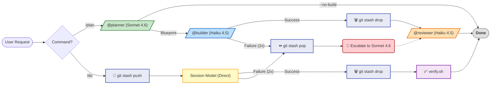

> **[English Version](README.md)**

<!-- Badges -->
[](https://www.npmjs.com/package/claude-pro-minmax)
[](https://www.npmjs.com/package/claude-pro-minmax)
[](https://nodejs.org/)


# Claude Pro MinMax (CPMM)

> **낭비는 최소화하고, 검증된 작업은 최대화합니다.**

CPMM은 모델 라우팅, 출력 제어, 로컬 안전장치로 리셋 전까지 더 많은 검증된 작업을 완료하도록 돕습니다.

> **설치 완료했다면 여기서 시작하세요: [사용자 가이드](docs/USER-MANUAL.ko.md)**
>
> **Context7 업데이트:** `cpmm setup`에서 `ctx7` 전역 설치 후 공식 Context7 Claude Code 설정까지 opt-in으로 실행할 수 있고, `/llms-txt`는 explicit raw-doc fallback으로 유지됩니다.

---

> [!TIP]
> **🚀 3초 요약: 왜 이걸 써야 하나요?**
> 1.  **배치 실행:** `/do`로 구현-검증을 한 흐름에서 처리하고, 필요할 때만 `/do-sonnet`/`/do-opus`로 승격합니다.
> 2.  **출력 비용 제어:** 응답 예산, CLI 필터링, 그리고 optional RTK로 Bash 출력이 Claude 입력 컨텍스트를 불필요하게 키우지 않도록 합니다.
> 3.  **로컬 안전장치:** 로컬 Hook + 원자적 롤백으로 실패 시 빠르게 복구합니다.

---

## 🛠 설치 (Installation)

### 1. 설치 (권장)
```bash
npm install -g claude-pro-minmax@latest
cpmm setup
cpmm doctor
```

### 2. 업데이트
```bash
npm install -g claude-pro-minmax@latest
cpmm setup
```

### 3. 트러블슈팅 (빠른 복구)
```bash
# 누락된 의존성 재설치
cpmm setup

# 상태 확인만
cpmm doctor
```

### 4. 선택: 최신 라이브러리 문서 설정

이제 interactive `cpmm setup`에서 권장 Context7 경로 전체를 opt-in으로 실행할 수 있습니다.

공식 수동 설정 경로:
```bash
npm install -g ctx7
ctx7 setup --cli --claude
```

- CPMM은 Context7를 기본 MCP 경로로 취급하지 않습니다.
- 공식 설정 후에는 Context7의 공식 문서 통합이 최신 라이브러리 문서 조회를 처리합니다.
- `/llms-txt`는 raw `/llms.txt` 내용이나 URL 기반 raw-doc 조회가 필요할 때만 사용하세요.

> **설치 참고:** `cpmm setup`은 지원 환경에서 RTK 설치를 계속 시도합니다. RTK 활성화는 여전히 opt-in이며, Context7 opt-in은 `ctx7` 전역 설치와 공식 Claude Code 설정을 함께 진행합니다.

의존성 정책:
- `required`: `jq`, `mgrep`, `tmux`
- `optional` (interactive opt-in): `ctx7` + 공식 Context7 Claude 통합
- `optional` (자동 설치 시도): `rtk`
- `optional` (확인만): `claude` (사전 설치 가정)
- 도구별 자동 설치 경로:
  - `mgrep`: `npm`
  - `ctx7`: `npm` + `ctx7 setup --cli --claude` (`cpmm setup`에서 interactive opt-in)
  - `rtk`: `brew` 또는 upstream `curl` installer
  - `jq`, `tmux`: `brew` (macOS) 또는 Linux 패키지 매니저 `apt-get`, `dnf`, `pacman`, `apk`
- macOS에서 Homebrew가 없으면 설치 명령을 안내합니다

### 5. 커스텀 & 업데이트 정책

- `cpmm setup`은 누락된 의존성을 설치한 뒤, CPMM 설정(설정 파일 복사, 언어 선택, Perplexity 설정, optional `ctx7` 설치 + 공식 Context7 설정, managed config 정리)까지 진행합니다.
- `cpmm doctor`는 수정 없이 의존성 상태, Context7 상태, RTK hook 상태를 확인합니다.
- 재실행 시 CPMM 관리 파일은 최신 버전으로 교체되고, 사용자 데이터는 보존됩니다.

```text
~/.claude/*            ← Global Baseline (CPMM 관리)
  ├── agents/            🔄 업데이트 시 교체됨
  ├── commands/          🔄 업데이트 시 교체됨
  ├── contexts/          🔄 업데이트 시 교체됨
  ├── scripts/           🔄 업데이트 시 교체됨
  ├── skills/cli-patterns/ 🔄 업데이트 시 교체됨
  ├── rules/*.md         🔄 업데이트 시 교체됨
  ├── settings.json      🔄 업데이트 시 교체됨
  ├── settings.local.json  ✋ 사용자 소유 — 보존됨
  ├── skills/learned/      ✋ 사용자 소유 — 보존됨
  ├── sessions/            ✋ 사용자 소유 — 보존됨
  ├── plans/               ✋ 사용자 소유 — 보존됨
  ├── projects/            ✋ 사용자 소유 — 보존됨
  └── rules/language.md    ✋ 사용자 소유 — 보존됨

<project>/.claude/*    ← Project-Specific (사용자/팀 커스텀)
  ├── CLAUDE.md          프로젝트별 지침
  ├── commands/          프로젝트 전용 슬래시 명령어
  ├── skills/            프로젝트 전용 스킬
  ├── rules/             프로젝트 전용 규칙
  └── settings.json      프로젝트 전용 권한/훅/MCP 비활성화
```

> **핵심 규칙 2가지:**
> 1. 글로벌 커스텀은 일반적으로 `settings.local.json`에 둡니다. `settings.json`은 CPMM 관리 대상이라 업데이트 시 덮어쓰기되므로, RTK 같은 third-party hook을 여기에 넣었다면 업데이트 후 다시 확인해야 합니다.
> 2. 커스텀 명령어/규칙은 프로젝트 `.claude/`에 — 글로벌 `commands/`는 CPMM이 관리합니다.

관리 설정 경계:
- `~/.claude.json`은 CPMM 관리 대상이며 업데이트 시 정리될 수 있습니다.
- regular file `~/.mcp.json`은 사용자 소유라 CPMM이 자동 수정하지 않습니다.
- symlink `~/.mcp.json`은 CPMM 관리 호환 경로로 취급합니다.

프로젝트 초기화 팁:
- `claude` 실행 전에 `project-templates/`를 참고해 프로젝트를 초기화하세요. (설치기는 `project-templates`를 `~/.claude`로 복사하지 않습니다.)

### 6. Bash 명령 출력 필터링 (RTK)

RTK는 CPMM이 지원하는 **선택적 Bash 명령 출력 필터링 계층**입니다. `cpmm setup`은 RTK 바이너리 설치를 시도하지만, RTK hook은 기본 활성화하지 않습니다.

RTK를 이번 릴리스에 선택 통합으로 넣은 이유는, Bash-heavy 워크플로우에서 긴 명령 출력이 Claude 입력 컨텍스트로 다시 들어가기 전에 이를 줄여 주기 때문입니다. CPMM은 권장 hook 순서를 문서화하고 `cpmm doctor`로 점검하며, 그 순서에서는 CPMM의 critical-action check가 RTK rewrite hook보다 먼저 실행되어야 합니다. 다만 hook 동작을 예측 가능하고 디버깅 가능하게 유지하기 위해 default-on이 아니라 opt-in으로 제공합니다.

권장 opt-in 절차:

```bash
rtk init -g --hook-only
# RTK를 켠 뒤에는 cpmm setup이 관리된 hook 순서와 timeout을 복원
cpmm setup
cpmm doctor
```

권장 `PreToolUse` 순서 (`~/.claude/settings.json`):
- 먼저 CPMM safety hook: `~/.claude/scripts/hooks/critical-action-check.sh` with `timeout: 5`
- 그 다음 RTK rewrite hook: `~/.claude/hooks/rtk-rewrite.sh` with `timeout: 10`

업데이트 참고:
- `cpmm setup`은 업데이트 시 `~/.claude/settings.json`을 다시 씁니다.
- `cpmm setup` 전에 RTK가 이미 켜져 있었다면, CPMM이 설정 재작성 뒤에 관리된 RTK hook 순서와 `timeout: 10`을 자동 복원합니다.
- 관리된 RTK 상태를 확인하려면 setup 뒤에 `cpmm doctor`를 실행하세요.

권장 검증:
- `/hooks`에서 CPMM hook과 RTK hook이 모두 로드되는지 확인
- 위험 명령이 여전히 CPMM에서 먼저 차단되는지 확인
- `cpmm doctor` 실행
- 실제 Bash-heavy 세션 후 `rtk gain --quota --tier pro` 확인

공개된 [RTK 통합 사용자 사례](https://github.com/move-hoon/claude-pro-minmax/issues/3)에서는 `rtk gain --quota --tier pro` 기준으로 Bash-heavy 워크플로우에서 `1,664`개 명령 동안 입력 토큰 `8.5M` 절감(`49.4%`)이 보고되었습니다. 절감률은 작업 부하와 세션 형태에 따라 달라질 수 있습니다.

롤백:

```bash
rtk init -g --uninstall
```

### 7. 고급 (선택)
<details>
<summary>Perplexity, 언어, 수동 설치 보기</summary>

**Perplexity/언어/Context7 설정 (필수 아님):**
- Perplexity는 `/dplan`의 웹 리서치에 사용됩니다. 설정하지 않아도 `/dplan`은 Sequential Thinking으로 동작하고, 최신 라이브러리 문서는 공식 Context7이 설치된 경우 사용할 수 있습니다. 나머지 모든 기능은 Perplexity와 무관합니다.
- 최초 인터랙티브 설치 시 `cpmm setup`이 출력 언어와 Perplexity API 키를 묻습니다.
- `cpmm setup`은 `ctx7` 전역 설치 후 공식 Context7 Claude Code 설정까지 optional 단계로 제안할 수 있습니다.
- 수동 검증:
  ```bash
  command -v ctx7
  ctx7 --version
  cpmm doctor
  ```
- 영어(기본): 파일이 필요 없습니다. `~/.claude/rules/language.md`가 있으면 삭제하세요.
- 비영어: `~/.claude/rules/language.md`를 만들어 원하는 언어를 지정하세요.
- Perplexity를 수동으로 설정하려면 `~/.claude.json`의 `mcpServers`에 아래를 추가하세요:

```json
"perplexity": {
  "command": "npx",
  "args": ["-y", "@perplexity-ai/mcp-server"],
  "env": {
    "PERPLEXITY_API_KEY": "YOUR_API_KEY_HERE"
  }
}
```

**수동 의존성 설치:**
```bash
# jq
brew install jq                 # macOS
sudo apt-get install -y jq      # Ubuntu/Debian
sudo dnf install -y jq          # Fedora/RHEL
sudo pacman -S --noconfirm jq   # Arch
sudo apk add jq                 # Alpine

# mgrep
npm install -g @mixedbread/mgrep
mgrep install-claude-code

# tmux
brew install tmux               # macOS
sudo apt-get install -y tmux    # Ubuntu/Debian
sudo dnf install -y tmux        # Fedora/RHEL
sudo pacman -S --noconfirm tmux # Arch
sudo apk add tmux               # Alpine
```

**소스에서 수동 설치:**
```bash
git clone https://github.com/move-hoon/claude-pro-minmax.git
cd claude-pro-minmax
node bin/cpmm.js setup
# 고급/디버그 경로 (동일한 내부 설치기):
# bash install.sh
```

</details>

---

## 🚀 빠른 시작 (Quick Start)

### ⚡ 첫 60초 (FTUE)

```bash
claude
> /plan 이 저장소를 분석하고 작은 개선 1개에 대한 3단계 실행 계획을 제안해줘.
> /do 1단계만 최소 변경으로 안전하게 구현해줘.
> /review .
> /session-save ftue-first-pass
```

### 🤖 에이전트 워크플로우

CPMM은 계층적 모델 라우팅을 제공합니다: `/plan`은 @planner (Sonnet 4.6) → @builder (Haiku 4.5) 체인으로 복잡한 작업을 처리하고, `/do`는 현재 세션 모델에서 직접 실행하여 속도를 높입니다.



### ⌨️ 명령어 가이드

**1. 핵심 명령어 (Core Commands)**

가장 자주 사용하는 필수 명령어입니다.

| 명령어 | 설명 | 추천 상황 |
| --- | --- | --- |
| `/do [작업]` | 빠른 구현 (세션 모델) | 간단한 버그 수정, 스크립트 작성 |
| `/plan [작업]` | **Sonnet 4.6** 설계 → **Haiku 4.5** 구현 | 기능 추가, 리팩토링, 복잡한 로직 |
| `/review [대상]` | **Haiku 4.5** (읽기 전용) | 코드 리뷰 (파일 또는 디렉토리 지정 가능) |

> **비용 최적화 Tip:** 간단한 작업에 `/do`를 사용하기 전 세션 모델을 Haiku로 설정하세요 (`/model haiku`) — @builder와 동일한 **API 입력 토큰 단가 기준 1/5**. 복잡한 작업에는 `/do-sonnet` 또는 `/plan`을 사용하세요.

<details>
<summary><strong>🚀 심화 명령어 (Advanced Commands) - Click to Expand</strong></summary>

더 정교한 작업이나 세션 관리를 위한 전체 명령어 목록입니다.

| 명령어 | 설명 | 추천 상황 |
| :--- | :--- | :--- |
| **🧠 심층 실행** | | |
| `/dplan [작업]` | **Sonnet 4.6** + Perplexity, Sequential Thinking, 공식 Context7 설치 시 | 라이브러리 비교, 최신 기술 조사 (심층 연구) |
| `/do-sonnet` | **Sonnet 4.6**로 직접 실행 | Haiku 4.5가 계속 실패할 때 수동 격상 |
| `/do-opus` | **Opus 4.6**으로 직접 실행 | 매우 복잡한 문제 해결 (비용 주의) |
| **💾 세션/컨텍스트** | | |
| `/session-save` | 세션 요약 및 저장 | 작업 중단 시 (시크릿 자동 제거) |
| `/session-load` | 세션 불러오기 | 이전 작업 재개 |
| `/compact-phase` | 단계별 컨텍스트 압축 | 세션 중간에 컨텍스트 정리 필요 시 |
| `/load-context` | 컨텍스트 템플릿 로드 | 프론트/백엔드 초기 설정 시 |
| **🛠️ 유틸리티** | | |
| `/learn` | 패턴 학습 및 저장 | 자주 반복되는 오류나 선호 스타일 등록 |
| `/analyze-failures` | 오류 로그 분석 | 반복되는 에러 원인 파악 |
| `/watch` | 프로세스 모니터링 (tmux) | 장시간 빌드/테스트 관찰 |
| `/llms-txt` | raw 문서 가져오기 | raw `/llms.txt` 내용 또는 직접 docs URL 로드 |

</details>

---

## 핵심 전략

> [!NOTE]
> Anthropic은 Pro quota의 정확한 계산 공식을 공개하지 않습니다. 이 README는 바로 적용 가능한 사용자 운영 규칙에 집중합니다. 전략 근거 실험 아카이브는 [핵심전략 실험 아카이브](docs/CORE_STRATEGY_EXPERIMENT_ARCHIVE.ko.md)를 참고하세요.

### 목표

**할당량 창마다 검증된 작업 1건당 소모를 줄여, 검증된 처리량을 최대화**하는 것입니다.

### 운영 원칙

1. 시작은 `Haiku + /do`로 합니다. (필요 시 먼저 `/model haiku`)
2. 단순 작업(보통 1-3 파일)은 `/do`로 빠르게 처리합니다.
3. 설계 판단이 필요하거나 멀티파일 체크포인트가 필요하면 `/plan`을 사용합니다.
4. Haiku로 반복 실패하면 `Sonnet + /do-sonnet`으로 승격합니다.
5. `Opus + /do-opus`는 정말 필요한 경우에만 사용합니다.
6. 컨텍스트가 길어지기 전에 compact로 정리합니다.
7. 상세 측정값과 실험 맥락은 [실험 아카이브](docs/CORE_STRATEGY_EXPERIMENT_ARCHIVE.ko.md)에서 확인합니다.

---

## 📚 문서 가이드 (Documentation Hub)

이 프로젝트는 컴포넌트별 상세 문서를 제공합니다. 구체적인 동작 원리와 커스터마이징 방법은 아래 링크를 참고하세요.

| 구분 | 설명 | 상세 문서 (클릭) |
| :--- | :--- | :--- |
| **📊 전략 근거** | 핵심전략을 뒷받침하는 실험 아카이브 | [📂 **실험 아카이브**](docs/CORE_STRATEGY_EXPERIMENT_ARCHIVE.ko.md) |
| **🧭 사용자 가이드** | 설치 직후 실무 운영 시나리오 중심 안내서 | [📂 **사용자 가이드**](docs/USER-MANUAL.ko.md) |
| **🤖 Agents** | Planner, Builder, Reviewer 등 에이전트의 역할과 프롬프트 정의 | [📂 **Agents 가이드**](.claude/agents/README.ko.md) |
| **🕹️ Commands** | /plan, /do, /review 등 14개 명령어 사용법 | [📂 **Commands 가이드**](.claude/commands/README.ko.md) |
| **🪝 Hooks** | Pre-check, Auto-format 등 11개 자동화 스크립트 로직 | [📂 **Hooks 가이드**](scripts/hooks/README.ko.md) |
| **📏 Rules** | 보안, 코드 스타일, 위험 명령어 차단 정책 | [📂 **Rules 가이드**](.claude/rules/README.ko.md) |
| **🧠 Skills** | CLI Patterns 같은 도구 스킬 사양 | [📂 **Skills 가이드**](.claude/skills/README.ko.md) |
| **🔧 Contexts** | Backend/Frontend 프로젝트별 컨텍스트 템플릿 | [📂 **Contexts 가이드**](.claude/contexts/README.ko.md) |
| **💾 Sessions** | 세션 요약 저장 및 관리 구조 | [📂 **Sessions 가이드**](.claude/sessions/README.ko.md) |
| **🛠️ Scripts** | Verify, Build, Test 범용 스크립트 모음 | [📂 **Scripts 가이드**](scripts/README.ko.md) |
| **⚙️ Runtime** | 프로젝트 언어/프레임워크 자동 감지 시스템 | [📂 **Runtime 가이드**](scripts/runtime/README.ko.md) |
| **🔌 Adapters** | 언어별(Java, Node, Go 등) 빌드 어댑터 상세 | [📂 **Adapters 가이드**](scripts/runtime/adapters/README.ko.md) |
| **🎓 Learned** | /learn 명령어로 축적된 패턴 데이터 | [📂 **Learned Skills**](.claude/skills/learned/README.ko.md) |

---

## 📂 프로젝트 구조

<details>
<summary><strong>📁 파일 트리 보기 (Click to Expand)</strong></summary>

```text
claude-pro-minmax
├── .claude.json                # 관리되는 글로벌 MCP 설정
├── .claudeignore               # Claude 컨텍스트 제외 규칙
├── .gitignore                  # Git ignore 규칙
├── CONTRIBUTING.md             # 기여 가이드
├── install.sh                  # 핵심 설치 스크립트 (`cpmm setup`이 내부 호출)
├── LICENSE                     # MIT 라이선스
├── README.md                   # 영문 문서
├── README.ko.md                # 국문 문서
├── package.json                # npm 패키지 매니페스트
├── bin/                        # CPMM CLI 엔트리포인트
│   ├── cpmm.js                 # `cpmm` 실행 진입점
├── lib/                        # CPMM CLI 코어 구현
│   └── cli.js                  # setup/doctor 명령 로직
├── .claude/
│   ├── CLAUDE.md               # 핵심 지침 (모든 세션에 로드됨)
│   ├── settings.json           # 프로젝트 설정 (권한, 훅, 환경변수)
│   ├── settings.local.example.json # ~/.claude/settings.local.json용 템플릿
│   ├── agents/                 # 에이전트 정의
│   │   ├── planner.md          # Sonnet 4.6: 아키텍처 및 설계 결정
│   │   ├── dplanner.md         # Sonnet 4.6+MCP: 외부 도구를 활용한 심층 계획
│   │   ├── builder.md          # Haiku 4.5: 코드 구현 및 리팩토링
│   │   └── reviewer.md         # Haiku 4.5: 읽기 전용 코드 리뷰
│   ├── commands/               # 슬래시 명령어
│   │   ├── plan.md             # 아키텍처 계획 (Sonnet -> Haiku)
│   │   ├── dplan.md            # 심층 리서치 계획 (Sequential Thinking)
│   │   ├── do.md               # 직접 실행 (기본 Haiku)
│   │   ├── do-sonnet.md        # Sonnet 모델로 실행
│   │   ├── do-opus.md          # Opus 모델로 실행
│   │   ├── review.md           # 코드 리뷰 명령어 (읽기 전용)
│   │   ├── watch.md            # tmux를 통한 파일/프로세스 모니터링
│   │   ├── session-save.md     # 현재 세션 상태 저장
│   │   ├── session-load.md     # 이전 세션 상태 복원
│   │   ├── compact-phase.md    # 단계별 컨텍스트 압축 가이드
│   │   ├── load-context.md     # 사전 정의된 컨텍스트 템플릿 로드
│   │   ├── learn.md            # 새로운 패턴을 메모리에 저장
│   │   ├── analyze-failures.md # 도구 실패 로그 분석
│   │   └── llms-txt.md         # raw /llms.txt 문서 조회
│   ├── rules/                  # 행동 규칙
│   │   ├── critical-actions.md # 위험 명령어 차단 (rm -rf, git push -f, etc.)
│   │   ├── code-style.md       # 코딩 컨벤션 및 표준
│   │   └── security.md         # 보안 모범 사례
│   ├── skills/                 # 도구 능력
│   │   ├── cli-patterns/       # 경량 일반 CLI 패턴
│   │   │   ├── SKILL.md        # 스킬 정의 및 사용법
│   │   │   └── references/     # CLI 참조 문서
│   │   │       ├── github-cli.md
│   │   │       └── mgrep.md
│   │   └── learned/            # /learn 명령어로 축적된 패턴
│   ├── contexts/               # 컨텍스트 템플릿
│   │   ├── backend-context.md  # 백엔드 전용 지침
│   │   └── frontend-context.md # 프론트엔드 전용 지침
│   └── sessions/               # 저장된 세션 요약 (Markdown)
├── .github/
│   └── ISSUE_TEMPLATE/
│       └── feedback.md         # 피드백용 이슈 템플릿
├── docs/                       # 프로젝트 문서
│   ├── CORE_STRATEGY_EXPERIMENT_ARCHIVE.md    # 실험 근거 아카이브 (EN)
│   ├── CORE_STRATEGY_EXPERIMENT_ARCHIVE.ko.md # 실험 근거 아카이브 (KO)
│   ├── USER-MANUAL.md          # 사용자 매뉴얼 (EN)
│   └── USER-MANUAL.ko.md       # 사용자 매뉴얼 (KO)
├── scripts/                    # 유틸리티 및 자동화
│   ├── verify.sh               # 범용 검증 스크립트
│   ├── build.sh                # 범용 빌드 스크립트
│   ├── test.sh                 # 범용 테스트 스크립트
│   ├── lint.sh                 # 범용 린트 스크립트
│   ├── commit.sh               # 표준화된 git commit 도우미
│   ├── create-branch.sh        # 브랜치 생성 도우미
│   ├── snapshot.sh             # /do 명령의 원자적 롤백 (git stash)
│   ├── analyze-failures.sh     # /analyze-failures용 로그 분석 도구
│   ├── scrub-secrets.js        # 세션 저장 시 시크릿 제거 로직
│   ├── hooks/                  # 제로-코스트 Hooks (자동화 체크)
│   │   ├── critical-action-check.sh # 위험 명령어 사전 차단
│   │   ├── tool-failure-log.sh      # 실패 로그 파일 기록
│   │   ├── pre-compact.sh           # 압축 전처리기
│   │   ├── compact-suggest.sh       # 3단계 컴팩션 경고 (25/50/75)
│   │   ├── post-edit-format.sh      # 편집 후 자동 포맷팅
│   │   ├── readonly-check.sh        # 리뷰어 읽기 전용 강제
│   │   ├── retry-check.sh           # 빌더 2회 재시도 제한 강제
│   │   ├── session-start.sh         # 세션 초기화 로직
│   │   ├── session-cleanup.sh       # 종료 시 정리 및 시크릿 제거
│   │   ├── stop-collect-context.sh  # 중단 시 컨텍스트 수집
│   │   └── notification.sh          # 데스크탑 알림
│   └── runtime/                # 런타임 자동 감지
│       ├── detect.sh           # 프로젝트 유형 감지 로직
│       └── adapters/           # 언어별 빌드 어댑터
│           ├── _interface.sh   # 어댑터 인터페이스 정의
│           ├── _template.sh    # 새 어댑터용 템플릿
│           ├── generic.sh      # 범용 폴백 어댑터
│           ├── go.sh           # Go/Golang 어댑터
│           ├── jvm.sh          # Java/Kotlin/JVM 어댑터
│           ├── node.sh         # Node.js/JavaScript/TypeScript 어댑터
│           ├── python.sh       # Python 어댑터
│           └── rust.sh         # Rust 어댑터
└── project-templates/          # 언어 및 프레임워크 템플릿
    ├── backend/                # 백엔드 프로젝트 템플릿
    │   └── .claude/
    │       ├── CLAUDE.md
    │       └── settings.json
    └── frontend/               # 프론트엔드 프로젝트 템플릿
        └── .claude/
            ├── CLAUDE.md
            └── settings.json
```

</details>

## 지원 런타임

| 런타임 | 빌드 도구 | Detection Files |
|--------|----------|----------|
| JVM | Gradle, Maven | `build.gradle.kts`, `pom.xml` |
| Node | npm, pnpm, yarn, bun | `package.json` |
| Rust | Cargo | `Cargo.toml` |
| Go | Go Modules | `go.mod` |
| Python | pip, poetry, uv | `pyproject.toml`, `setup.py`, `requirements.txt` |

새 런타임을 추가하려면 `scripts/runtime/adapters/_template.sh`를 복사하여 구현하세요.

---

## FAQ

<details>
<summary><strong>Q: 이 설정은 어떻게 Pro Plan quota를 최적화하나요?</strong></summary>

A: Anthropic의 정확한 quota 알고리즘은 공개되지 않았습니다. 세 가지 축으로 최적화합니다:
- **저비용 모델 우선 경로**: 기본 구현은 Haiku 중심으로 시작하고 필요 시에만 Sonnet/Opus로 승격합니다.
- **출력 비용 인식**: 출력이 많은 턴일수록 비용 부담이 커지는 경향이 있으므로, 응답 예산과 필터링으로 payload를 줄입니다.
- **작업 흐름 단순화**: `/do`와 `/plan`을 상황에 맞게 분리해 불필요한 고비용 턴을 줄입니다.

근거 실측값은 [docs/CORE_STRATEGY_EXPERIMENT_ARCHIVE.ko.md](docs/CORE_STRATEGY_EXPERIMENT_ARCHIVE.ko.md)를 참고하세요.
</details>

<details>
<summary><strong>Q: 5시간 내내 Claude를 사용할 수 있나요?</strong></summary>

A: **보장되지 않습니다**. 세션 길이는 다음에 따라 다릅니다:
- 작업 복잡도 (간단한 수정 vs. 대규모 리팩토링)
- 모델 사용 (주로 Haiku vs. 주로 Opus)
- 컨텍스트 크기 (작은 파일 vs. 전체 코드베이스)

이 설정은 Pro Plan 제약 내에서 세션 길이를 최대화하도록 설계되었지만, quota 한계를 우회할 수는 없습니다.
</details>

<details>
<summary><strong>Q: Max Plan에서도 사용할 수 있나요?</strong></summary>

A: 네, 하지만 이러한 최적화가 필요하지 않을 수 있습니다. Max Plan은 훨씬 높은 사용 제한을 제공하여 Pro Plan 제약이 덜 관련됩니다. Max Plan 사용자라면:
- Opus를 기본 모델로 quota 걱정 없이 사용 가능
- Git Worktrees와 병렬 세션이 실용적
- 출력 예산과 배치 실행은 여전히 좋은 습관이지만 필수는 아님

이 설정은 Pro Plan의 5시간 rolling reset과 메시지 기반 quota 시스템을 위해 특별히 설계되었습니다.
</details>

<details>
<summary><strong>Q: 기존 Claude Code 설정과 충돌하나요?</strong></summary>

A: 최초 `cpmm setup` 시 기존 `~/.claude`를 `~/.claude.pre-cpmm`으로 백업합니다. 재실행 시 CPMM 관리 경로는 재생성되고, 사용자 소유 경로(언어 설정, 로컬 설정, 학습 패턴, 세션)는 보존됩니다. 정확한 경계는 설치 섹션의 2-Layer 구조를 참고하세요.
</details>

<details>
<summary><strong>Q: 어떤 OS를 지원하나요?</strong></summary>

A: macOS와 Linux를 지원합니다. Windows는 WSL을 통해 사용 가능합니다.
</details>

<details>
<summary><strong>Q: 왜 모든 작업에 Opus를 사용하지 않나요?</strong></summary>

A: API 가격(컴퓨팅 비용 반영)을 보면 Opus 4.6 ($5/MTok input)은 Sonnet 4.6 ($3/MTok)나 Haiku 4.5 ($1/MTok)보다 훨씬 비쌉니다. 정확한 Pro Plan quota 영향은 공개되지 않았지만, 모든 작업에 Opus 4.6을 사용하면 quota가 훨씬 빠르게 소진될 것입니다. 명시적 모델 선택(`/do-opus`)으로 비싼 모델 사용 시 인지할 수 있도록 합니다.
</details>

<details>
<summary><strong>Q: /do 실행 중 실패하면 어떻게 되나요?</strong></summary>

A: CPMM은 `scripts/snapshot.sh`를 통한 **best-effort 원자적 롤백**을 사용합니다.

- `/do` 실행 전 `snapshot.sh push`로 라벨된 stash 스냅샷을 시도합니다.
- 실패 시 `snapshot.sh pop`이 복구를 시도하며, 아래 상태 중 하나를 반환합니다:

| 상태 | 의미 |
| --- | --- |
| `RESTORED` | CPMM 라벨 stash를 정상 pop하여 복구 완료 |
| `RESTORE_FAILED` | `git stash pop` 실패 (예: 충돌) |
| `CHECKOUT_CLEAN` | CPMM stash가 없어 fallback `git checkout .` 성공 |
| `CLEAN_FAILED` | fallback 정리도 실패 |

롤백 후에도 완전히 깨끗하지 않다면:
1. `git status` 확인
2. `git stash list` 확인
3. 충돌 해결/새 untracked 파일 수동 정리 후 재시도

- 비용: 0 (git stash는 로컬 작업)
- 제한: 기존(tracked) 파일만 추적. 새로 생성된 파일은 수동 제거 필요.
</details>

---

## 참고 링크

- 핵심전략 근거 실험 아카이브: [핵심전략 실험 아카이브](docs/CORE_STRATEGY_EXPERIMENT_ARCHIVE.ko.md)
- 방향성 비교를 위한 외부 역분석 사례: [claude-limits](https://she-llac.com/claude-limits) (Claude 플랜 usage/credits 동작을 설명하려는 비공식 분석)
- 공식 문서:
  - [Anthropic Pricing](https://docs.anthropic.com/en/docs/about-claude/pricing)
  - [Usage Limit Best Practices](https://support.claude.com/en/articles/9797557-usage-limit-best-practices)
  - [Understanding Usage and Length Limits](https://support.claude.com/en/articles/11647753-understanding-usage-and-length-limits)

---

## Credits

- **[affaan-m/everything-claude-code](https://github.com/affaan-m/everything-claude-code)** — Anthropic 해커톤 우승작. 이 프로젝트의 기반입니다.
- **[@affaanmustafa](https://x.com/affaanmustafa)** — mgrep 벤치마크 데이터 ($0.49 → $0.23, ~50% 절약), [Longform Guide to Everything Claude Code](https://x.com/affaanmustafa/status/2014040193557471352) 출처.
- [Claude Code 공식 문서](https://code.claude.com/docs/en/)

## 기여

오픈소스 프로젝트입니다. 기여를 환영합니다!

1. 저장소 Fork
2. 기능 브랜치 생성 (`git checkout -b feature/amazing-feature`)
3. 변경 사항 커밋 (`git commit -m 'feat: Add amazing feature'`)
4. 브랜치에 Push (`git push origin feature/amazing-feature`)
5. Pull Request 생성

## 라이선스

MIT License
