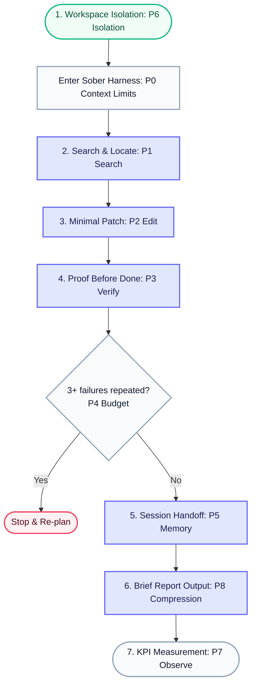

# Sober


[](https://www.npmjs.com/package/getsober)
[](https://nodejs.org)
[](LICENSE)
[](http://makeapullrequest.com)
[](https://github.com/move-hoon/sober)

---

<div align="center">

**Language / 언어**

[**English**](README.md) | [한국어](README.ko.md)

</div>

---

**Keep your AI coding agent calm, constrained, and evidence-driven.**

Sober is a local control harness for Claude Code and Codex CLI. It keeps agents from over-reading, over-editing, and claiming “done” without proof by making them follow a simple working loop:

```text
locate facts → read only what matters → make the smallest safe change → verify → leave a handoff
```

At the center is one shared `AGENTS.md`: the workflow contract both runtimes follow.

Your existing config is preserved. Sober only adds or refreshes its managed blocks, symlinks, hooks, and rules. Uninstall removes only Sober-owned files.

Use Sober as the default control layer, then add your own commands, subagents, MCP tools, and project-specific rules on top.

---

## Quick Start

### Prerequisites
- **OS**: macOS or Linux. Windows users should use WSL.
- **Agents**: [Claude Code](https://docs.anthropic.com/en/docs/claude-code) or [Codex CLI](https://github.com/openai/codex) must be installed.
- **Runtime**: Node.js 18+

---

### 3-Step Developer Workflow

Establish calm working habits for your AI agent in three simple steps.

#### **Step 1: Global Installation & Setup**
Choose the installation path that best fits your development environment:

##### **Option A: Interactive Installer (Highly Recommended for First-Time Setup)**
Deploys Sober rules/hooks and interactively checks/guides you through installing optional deterministic tools (`jq`, `ripgrep`, `ast-grep`, `Probe`, and `Context7`).
```bash
npm install -g getsober@latest
sober setup
```

##### **Option B: Core Configuration Only (Silent Update)**
Only deploys Sober's core policy and skill files to `~/.sober` and links them to the AI runtimes. (Best for updates or if you already have the required tools installed).
```bash
npm install -g getsober@latest
sober install
```

---

#### **Step 2: Project Integration**
Navigate to your project root and generate the local policy contract (`AGENTS.md`) and session memory (`HANDOFF.md`).
```bash
cd your-project
sober template .  # Generates local agent contract & handoff templates
sober claude      # or: sober codex
```

Launch an agent through Sober:
```bash
sober codex
sober claude
sober codex --yolo
sober claude --yolo
```

> [!NOTE]
> `--yolo` bypasses approvals/permissions. Use it only in isolated environments.

> [!TIP]
> Prompt your agent with clear, scoped requests to see Sober in action:
> ```text
> Fix the login timeout bug.
> Find the right lines first, make the smallest safe change, and verify with tests.
> ```

---

#### **Step 3: Diagnostics & Maintenance**
Use these commands to diagnose the toolchain status or safely remove configurations:

- **Run Diagnostics**: Checks the status of hooks, skills, dependencies, and optional tools.
  ```bash
  sober doctor
  ```
- **Safe Uninstall**: Removes Sober-owned symlinks, managed hook entries, and the `~/.sober` directory, leaving your own runtime configurations in place.
  ```bash
  sober uninstall
  ```

---

### Where does it install?

Sober operates within two distinct, decoupled scopes:

* 🏠 **Global Scope (`~/`)** — created by `sober setup` or `sober install`
  * `~/.sober`: Canonical source of truth for Sober policies, hooks, and skills.
  * `~/.claude` & `~/.codex`: Configuration and rules safely merged with your existing runtime settings.
* 📁 **Local Scope (`./`)** — created by `sober template`
  * `[project]/AGENTS.md`: The project-specific policy spine governing the agent.
  * `[project]/HANDOFF.md`: Local session memory ensuring seamless task handoffs between invocations.

---

## Why Sober?

AI coding agents are powerful, but their default behavior is often too eager.

| Without Sober                      | With Sober                                     |
| ---------------------------------- | ---------------------------------------------- |
| Reads entire files to find one line | Finds the exact `file:line` first              |
| Guesses where code lives           | Checks candidates with deterministic tools     |
| Rewrites more than the task asked for | Makes the smallest safe patch               |
| Formats or cleans unrelated code   | Leaves unrelated files alone                   |
| Says "done" without proof          | Runs the closest build, test, or verification  |
| Repeats the same failed idea       | Stops after repeated failures and re-plans     |
| Produces long confident summaries  | Reports result, changed files, tests, and risks|
| Loses context between sessions     | Leaves a bounded `HANDOFF.md`                  |

**The goal: keep the model for judgment, while the workflow stays factual, small, and verifiable.**

---

## What is Sober?

Sober is not another AI agent. It is not a hosted service, a prompt pack, or a token optimizer.

Sober is a local control harness for the AI coding tools you already use: **Claude Code** and **Codex CLI**.

It installs a shared `AGENTS.md`, skills, and hooks that keep your existing agents inside a disciplined workflow:

- **Fact before context** — locate the exact `file:line` before opening broad files.
- **Evidence before edits** — verify the target with deterministic tools before changing code.
- **Small patches only** — touch only what the task requires.
- **Proof before "done"** — run the closest build, test, or verification step.
- **Stop after repeated failure** — do not burn more context repeating the same failed guess.
- **Brief reports only** — report result, changed files, verification, and risks.
- **Visible handoff** — preserve session state in a local `HANDOFF.md`.

After installing, you keep running `claude` or `codex` exactly as before.

Don't like it? Run `sober uninstall` to remove Sober-owned links, hooks, and `~/.sober` while leaving your own config in place.

---

## How Sober Works

Sober operates on three levels: a visual workflow loop, core architectural principles, and the concrete agent contract.

### 1. The Sober Loop (Execution Flow)

Sober does not create a new agent; it keeps your existing Claude Code and Codex CLI inside a calm, turn-by-turn execution workflow:



The loop lives in [`AGENTS.md`](AGENTS.md), the single rules file both runtimes read. Each policy (P0–P8) is mapped to its operational role within the cycle:

* **Sequential Execution Steps** (`P1` → `P2` → `P3` → `P5`)
  * Governs the core linear task lifecycle: progresses from **Search & Locate (P1)** → **Minimal Patch (P2)** → **Proof Before Done (P3)** → **Session Handoff (P5)**.
* **Continuous Guardrails** (`P0`, `P4`, `P8`)
  * Active throughout the loop: nudges the agent to compact context as it grows (**P0**), requests stopping to re-plan on repeated failures (**P4**), and guides compressed output formatting (**P8**).
* **Workspace & KPI Feedback** (`P6`, `P7`)
  * Establishes the git-isolated workspace (**P6**) before starting, and measures baseline metrics (**P7**) when adding rules or tools.


On top of Sober, you can freely add custom commands, subagents, MCP tools, and project-specific rules.


### 2. The 5 Invariants (Design Pillars)

No matter how advanced models become, Sober is designed around these five future-proof, architectural pillars:

1. **Policy Contract:** The P0-P8 rules that cage the LLM to irreducible judgment.
2. **Deterministic Offload:** Code/tools handle search, transformation, and bulk output.
3. **Verification Gate & Isolation:** Warns on unverified state changes and keeps work within reversible git boundaries (like worktrees).
4. **Persistent Human-Reviewed Memory:** Local file-based memory (`HANDOFF.md`) instead of opaque databases.
5. **Observation:** Every addition must be justified by measurement.

### 3. The Sober Contract (Agent Rules)

At the center of Sober is one shared `AGENTS.md`. It is the contract Sober installs where Claude Code and Codex CLI look for agent instructions. It constrains the agent's default behavior into a stricter, resource-saving loop:

| Policy | Core Rule | Details & Constraints |
| :--- | :--- | :--- |
| **`P0 Context`** | **Context discipline** | Never read whole files; find the exact `file:line` and adjacent ~2 lines first. Pipe all search results to `| head` and suggest context compaction as the context grows. |
| **`P1 Search`** | **Search before reading** | Never hand-grep; use `ripgrep` for exact/regex keyword matches, structural `Probe` for definitions and call-sites, and semantic `mgrep` for abstract concepts as a last resort. |
| **`P2 Edit`** | **Small patches only** | Touch only what the task requires and minimize LLM rewrites by offloading edits to `ast-grep --rewrite` for repeated mechanical patches and Serena `replace_symbol` for type-aware single-symbol updates. |
| **`P3 Verify`** | **Proof before "done"** | Nudges the agent to avoid editing based on unverified guesses. Verify candidates/sites first using `ripgrep`, `Probe`, or Serena (in a single call), and request the closest possible build/test/verification steps before declaring completion. |
| **`P4 Budget`** | **No repeated failure loops** | Strictly respect turn budgets (1 search, 1-2 edits, 3 debugs). Immediately stop to re-plan after 3 failed hypotheses rather than looping on the same guess. |
| **`P5 Memory`** | **Visible handoff** | Write session state to `HANDOFF.md` and persistent architectural facts to `.serena/memories` for human review (no auto-execution or blind injection). |
| **`P6 Isolation`** | **Reversible isolation** | Keep changes within clean git boundaries. Run independent work (like parallel tasks, repo-scale exploration, or fresh review/pre-commit checks) using native git worktrees or subagents. |
| **`P7 Observe`** | **Measure additions** | Justify any new tools, rules, or hooks by measuring cost, context fill, and retries. Roll back the change immediately if a metric worsens. |
| **`P8 Compression`** | **Brief reports** | Avoid verbose prose or redundant file reprints. Format replies to include the final result, changed files, and test outcomes only, using the `caveman` compression skill when loaded. |


#### How the contract maps to tools

| Contract Policy | Supporting Component (under `~/.sober/`) |
| :--- | :--- |
| **`P0` / `P1` Limits & Search** | `search-ladder` skill, `ripgrep`, Probe |
| **`P2` Minimal Patching** | `edit-deterministic` skill, `ast-grep`, Serena (LSP) |
| **`P3` Proof Before Done** | `verify-gate` hook, `verify.sh` script |
| **`P4` Exit on Repeated Failures** | `tool-failure-log` hook, `analyze-failures.sh` command |
| **`P5` Handoff & Continuity** | `handoff-write` hook, `HANDOFF.md` file |
| **`P8` Compressed Brief Reports** | `caveman` skill |
| **`P7` KPI & Additions Measurement** | `observe` skill, `/measure` command |


---

## Usage Guide

### Writing effective prompts

Broad prompts without a stop condition waste the most quota. Always include what "done" looks like.

The single most important habit: **tell the agent what to do, what not to touch, and how to verify.**

Good prompt:

```text
Change the payment retry timeout from 3s to 5s.
Keep behavior unchanged otherwise.
Verify with the existing payment tests.
```

Bad prompt:

```text
Clean up this repo.
```

### Skills — what they are and when to use them

Skills are not terminal commands. They are small instruction packs that shape how the agent works.

You rarely need to name them directly. Describe the behavior you want.

| Skill                | When it helps                                                              | Example prompt                                                                                                              |
| -------------------- | -------------------------------------------------------------------------- | --------------------------------------------------------------------------------------------------------------------------- |
| `karpathy`           | Every task                                                                 | "Do only the requested change. Don't clean unrelated files."                                                                |
| `search-ladder`      | Finding code                                                               | "Find the relevant `file:line` first. Don't read whole files."                                                              |
| `edit-deterministic` | Repeated changes                                                           | "Use a repeatable rewrite for all similar call sites."                                                                      |
| `caveman`            | Long responses                                                             | "Report only result, changed files, tests, and risks."                                                                      |
| `observe`            | Adding tools/rules                                                         | "Measure before and after. Keep it only if the metric improves."                                                            |
| `sober-review`       | Before commit                                                              | "Run the sober-review checklist. Report issues only. Don't edit."                                                           |
| `structure-graph`    | Large or unfamiliar repos with unclear flows, dependencies, or blast radius | "Map with GitNexus CLI for structure hints; before reading deeply or editing, verify the candidate with rg/Probe."          |

### When the agent gets stuck

Don't push harder — redirect.

1. **Shrink the task** into a smaller piece.
2. **Ask for a plan** before more edits: "Write a 3-line plan before changing anything."
3. **Re-check evidence** — the search results may be stale.
4. **3 failures = stop** — if the same idea failed three times, stop and re-plan from scratch.
5. **Analyze tool errors** — in Claude Code, use `/analyze-failures`. In Codex CLI, ask it to run `~/.sober/scripts/analyze-failures.sh`, read only the script output, summarize repeated failure patterns, and propose the next smallest plan.

### Session handoff

Long conversations get noisy. Before stopping, ask for a bounded handoff:

```text
Summarize only: verified facts, remaining risks, and the next command to run.
```

Sober's handoff hook automatically writes a small `HANDOFF.md` with the current branch, last commit, and uncommitted changes when a session ends in a git project.

When you start a new session, ask the agent to read `HANDOFF.md` first to pick up where you left off.

### Review before commit

For non-trivial changes, run a read-only review:

```text
Run the sober-review checklist on this diff.
Report PASS or ISSUES only. Do not edit files.
```

This checks correctness, scope, complexity, style, verification coverage, and basic security — without touching code.

### Measure before adding

Before adding any new tool, skill, or rule, run a before/after check.

In Claude Code you can use Sober's `/measure` command. In Codex, use the same wording as a normal prompt:

```text
/measure baseline
# make exactly one change to your setup
/measure after
```

Key metrics to watch:

- Files read per task
- Output tokens
- Peak context fill
- Retry rate

If any metric gets worse, roll back.

---

## Optional Tools

Sober works without these tools. Some of them reduce files read, output volume, or retry loops for specific tasks.

`sober setup` interactively offers the core search/edit toolkit — `ripgrep`, `ast-grep`, `Probe` — plus Context7 setup.

Conditional tools such as `GitNexus`, `Serena`, and `mgrep` are reported by `sober doctor` and should be added manually only when they pay for themselves.

### Core optional toolkit

These tools pay off in most projects. They make Sober's default loop — search, minimal edit, verify, brief report — cheaper and more reliable.

| Tool | Sober role | Trigger |
|---|---|---|
| `ripgrep` | Locate exact text fast | Known symbol, keyword, or regex |
| `ast-grep` | Apply mechanical rewrites | Repeated code-shape changes |
| Probe | Find structural code candidates | Definitions, call sites, code patterns |

### Conditional tools

Add these only when the task calls for them. They are not part of the default install path; `sober doctor` reports their status and install hints.

| Tool | Sober role | Trigger |
|---|---|---|
| Serena | Symbol-aware navigation and edits | Type-aware single-symbol changes |
| Context7 / `ctx7` | Current external docs | Library API uncertainty |
| `gitnexus` | Structure hints for large repos | Unclear flow, dependency, or blast radius |
| `mgrep` | Last-resort concept search | Exact token name is unknown |

Sober does not treat optional tools as always-on power-ups. Tools are selected by trigger, verified by evidence, and rolled back if they increase read volume, output volume, or retry rate.

**GitNexus note:** Sober treats GitNexus as a structure-hint generator, not a source of truth. Use `gitnexus analyze --skip-agents-md --skip-skills --skip-embeddings`, then verify candidates with `rg` or Probe before deep reading.

```bash
sober setup       # installs policy, then interactively offers the core toolkit and Context7 setup
sober doctor      # shows current status and install hints for conditional tools
```

For Context7 directly:

```bash
npm install -g ctx7
ctx7 setup --cli --claude
ctx7 setup --cli --universal
```

For Codex MCP mode, enable Context7 explicitly:

```bash
codex mcp add context7 -- npx -y @upstash/context7-mcp --api-key YOUR_API_KEY
```

---

## Safety & Privacy

- **Additive install** — never overwrites your config; merges only Sober-owned hooks and rules.
- **Local at runtime** — no hosted Sober service; setup may download optional tools you choose.
- **No API keys** — never asks for or touches your model credentials.
- **Safety guardrails** — dangerous commands are caught by hooks for Claude and Starlark rules for Codex.
- **Advisory verification** — verification reminders do not block your `git commit`.
- **No hidden memory** — session memory is a visible `HANDOFF.md` file you can read and edit.
- **Secret redaction** — failure logs mask API keys and tokens before writing.

---

## Troubleshooting

| Symptom                       | Fix                                                |
| ----------------------------- | -------------------------------------------------- |
| Agent says a hook is missing  | `sober doctor`, then `sober install`               |
| Search tool not found         | Keep working, or run `sober setup` to install it   |
| Verification runs wrong stack | `~/.sober/scripts/verify.sh --path <subdir>`       |
| Tool failures repeat          | `/analyze-failures` (Claude) or run script (Codex), then re-plan |
| Output too long               | Ask: "Show only result, diff, and file:line"       |

---


## Internal Structure & Reference


### Project template output

```text
your-repo/
├─ AGENTS.md          # project-specific header + shared Sober spine
├─ CLAUDE.md          # symlink to AGENTS.md (single source)
├─ HANDOFF.md         # bounded, reviewed session state
└─ sgconfig.yml       # optional, only with --with-sgconfig
```

### What gets installed

```text
┌──────────────────────────────────────────────────────────────┐
│                         Sober                                │
│                    shared home: ~/.sober                     │
│                                                              │
│   ┌──────────────┬──────────────┬────────────────────────┐   │
│   │   AGENTS.md  │   skills/    │        scripts/        │   │
│   │ shared rules │ tool habits  │ safety + handoff hooks │   │
│   └──────────────┴──────────────┴────────────────────────┘   │
│             ↓              ↓                  ↓              │
│        Claude Code      Codex CLI        project template    │
│        ~/.claude        ~/.codex         AGENTS/HANDOFF      │
│             ↓              ↓                  ↓              │
│      merged settings   hooks + rules     local overrides     │
└──────────────────────────────────────────────────────────────┘
```

### Installed file tree

```text
~/.sober/AGENTS.md                    # shared policy source
~/.sober/commands/*.md                # Sober-owned Claude slash commands
~/.sober/rules/*.md                   # Sober-owned Claude rules
~/.sober/skills/<skill>/SKILL.md      # one copy of each skill
~/.sober/scripts/                     # local hook and verification scripts
~/.sober/codex-rules/*.rules          # installed copy of .sober/codex/rules

# Claude Code
~/.claude/CLAUDE.md                   # symlink to ~/.sober/AGENTS.md, or managed @import block
~/.claude/AGENTS.md                   # symlink to ~/.sober/AGENTS.md, or managed @import block
~/.claude/commands/<cmd>.md           → ~/.sober/commands/<cmd>.md
~/.claude/rules/<rule>.md             → ~/.sober/rules/<rule>.md
~/.claude/skills/<skill>              → ~/.sober/skills/<skill>
~/.claude/settings.json               # Sober hooks additively merged

# Codex CLI
~/.codex/AGENTS.md                    # contains/refreshes the Sober spine inline
~/.agents/skills/<skill>              → ~/.sober/skills/<skill>
~/.codex/hooks.json                   # Sober hooks additively merged
~/.codex/rules/*.rules                → ~/.sober/codex-rules/*.rules
```

### Runtime hooks

| Hook                    | What it does                                                       |
| ----------------------- | ------------------------------------------------------------------ |
| `critical-action-check` | Blocks dangerous shell commands                                    |
| `verify-gate`           | Warns before commit/push if changes are unverified; advisory-only  |
| `handoff-write`         | Writes `HANDOFF.md` on session stop                                |
| `session-start`         | Loads safe env vars and shows budget reminder                      |
| `compact-suggest`       | Suggests compaction when context gets long                         |
| `post-edit-format`      | Auto-formats edited files if a formatter exists                    |
| `tool-failure-log`      | Logs tool failures locally with secret redaction                   |

Codex runs the same hooks via `~/.codex/hooks.json`. The `sober-critical-actions.rules` file adds an extra Starlark check for dangerous commands.


---

## Code review and helper agents

Sober ships a review checklist, not a fixed reviewer pipeline.

Use a separate helper only when it pays for itself: reviewing non-trivial changes with fresh eyes, exploring large unfamiliar repos, or running truly independent tasks in parallel.

Avoid fixed multi-agent chains for everyday work. The checklist is in `.sober/skills/sober-review`; the actual helper can be Claude Code's native subagent, a Codex helper, or a reviewer you already trust.

---

## Develop

```bash
git clone https://github.com/move-hoon/sober.git
cd sober
npm test
npm pack --dry-run
```

- Design decisions: [`docs/adr/`](docs/adr/) 
- Contributing: [`CONTRIBUTING.md`](CONTRIBUTING.md)

## License

MIT — see [LICENSE](LICENSE).
